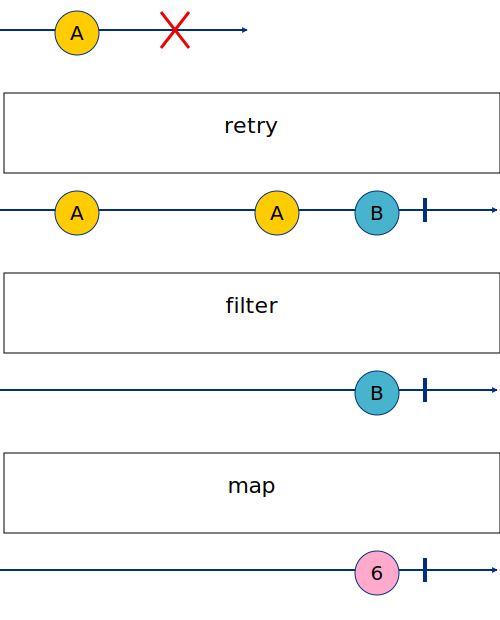

# 01 - Basic Operator - Hints

La principale difficulté est probablement de faire mentalement la différence entre les éléments émis par l'observable, qui sont ici des arrays d'`Order`, et les éléments de l'array sur lesquels on va également devoir faire des opérations.

Autrement dit on travaille d'abord sur notre observable pour agir sur chaque émission. Pour faire cela on a à notre disposition les opérateurs RxJS et au sein de ces opérateurs on va pouvoir utiliser les opérateurs JavaScript plus "classiques" et dans notre cas des opérateurs sur les arrays.

## Challenge 1

Comme décrit dans l'énnoncé du challenge, on cherche à filtrer les émissions de l'observable pour ne garder que les arrays d'`Order` qui sont tous valides.

On va donc se servir de l'opérateur [filter](https://rxjs.dev/api/index/function/filter).

Il prend en paramètre une fonction qui va être appelée pour chaque émission de l'observable et qui doit retourner un booléen. Si la fonction retourne `true` alors l'émission est gardée, sinon elle est ignorée. Exactement le même comportement que la fonction `filter` des arrays.

## Challenge 2

On cherche ici à faire une transformation sur chaque émission de l'observable.

On va donc se servir de l'opérateur [map](https://rxjs.dev/api/index/function/map).

Il fonctionne également comme la fonction `map` des arrays, il prend en paramètre une fonction qui va être appelée pour chaque émission de l'observable et qui doit retourner une valeur. Cette valeur sera ensuite transmise dans la suite du pipe.

## Challenge 3

On se rend compte que l'observable peut émettre des erreurs, on veut retenter de s'abonner automatiquement à l'observable en cas d'erreur.

On va donc se servir de l'opérateur [retry](https://rxjs.dev/api/index/function/retry).

Il prend (facultativement) en paramètre un nombre de tentatives, si l'observable émet une erreur, il va retenter de s'abonner à l'observable jusqu'à atteindre le nombre de tentatives.

## Recap - marble diagram

`A` est l'array avec des éléments invalides, `B` est l'array avec des éléments valides.

