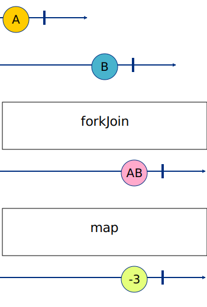

# 02 - Join Operator 1

## Challenge 1

Le but est de combiner plusieurs observables au départ indépendants en un seul.
Pour cela pas mal de possibilités existent et sont plus ou moins pertinentes selon le cas d'usage.

Pour notre cas d'usage (appel à une "API"), [forkJoin](https://rxjs.dev/api/index/function/forkJoin) semble assez pertinent.

Il prend en paramètre un nombre variable d'observables (sous forme d'array ou objet) et retourne un observable correspondant à la forme/shape du paramètre (array ou objet), à la différence près que les valeurs correspondent à la dernière valeur émise de chaque observable avant complétion.

Citation de la doc si cela n'était pas clair :
> If you pass an array of n observables to the operator, then the resulting array will have n values, where the first value is the last one emitted by the first observable, second value is the last one emitted by the second observable and so on.
>
> If you pass a dictionary of observables to the operator, then the resulting objects will have the same keys as the dictionary passed, with their last values they have emitted located at the corresponding key.

## Challenge 2

Rien de nouveau ici, on utilise les opérateurs RxJS vus précédemment : [map](https://rxjs.dev/api/index/function/map).

## Recap - marble diagram

`A` et `B` sont les résultats des 2 observables.

`AB` est la combinaison des 2 observables (sous forme d'array ou objet selon comment `forkJoin`est utilisé).

`-3` est le nombre de parts de nourriture restantes.

