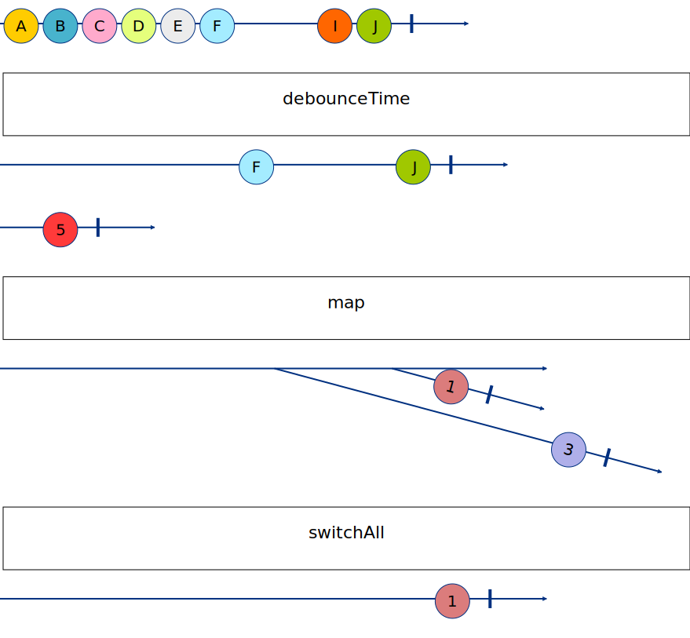

# 03 - Join Operator 2

## Challenge 1

Nous avons donc un observable qui émet des valeurs à chaque fois que l'utilisateur tape dans l'input. Pour chaque valeur émise, nous devons appeler une API pour récupérer les adresses correspondantes.

On a déjà fait ça, c'est simple ! Transformer une émission en une autre valeur, grace à `map` !

Bon par contre on a maintenant un observable qui émet des observables (higher-order Observable), alors qu'on veut un observable qui émet des valeurs (first-order Observable). Comment faire ?

On peut creuser l'opérateur [switchAll](https://rxjs.dev/api/operators/switchAll) qui permet "d'applatir" un higher-order Observable en first-order Observable. C'est un peu le `flatten` de RxJS (on verra qu'il existe d'autres opérateurs de ce genre).

Les opérateurs `map` et `switchAll` sont très souvent utilisés ensemble, il existe donc un opérateur qui les combine : [switchMap](https://rxjs.dev/api/operators/switchMap).

## Challenge 2

Un opérateur assez simple mais qui peut être très utile, [debounceTime](https://rxjs.dev/api/operators/debounceTime).

Il prend en paramètre un nombre de millisecondes et ne renvoie que la dernière valeur émise par l'observable dans cette fenêtre de temps.

## Recap - marble diagram

Les lettres `A` à `J` représentent les valeurs émises par l'observable de l'input.

La ligne du `5` est "l'observable type" qui sera utilisé dans le `map` (il n'est pas appelé directement).

`3` et `1` sont les résultats émis par l'observable de `getAddressesCompletion()`.

