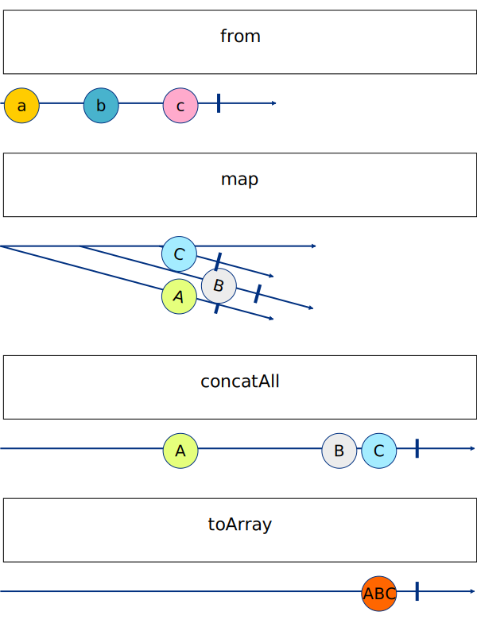

# 04 - Join Operator 3 - Hints

Qu'on soit clair, il y a plusieurs manières de résoudre cet exercice.

## Challenge 1

Pour créer un observable à partir d'une variable, plusieurs possibilités : `of` et `from` en tête.

Pour une array, `from` est plus adapté car il va émettre chaque élément de l'array séparément. On va donc avoir un observable qui émet `Product` par `Product`.

## Challenge 2

Ici, c'est du déjà vu, on part d'un observable auquel on branche un pipe avec un `map` qui va transformer chaque `Product` en `Required<Product>` (`Product` avec un stock).

## Challenge 3

On a aussi déjà vu un cas un peu similaire avant, il va juste falloir réfléchir à quel opérateur utiliser pour transformer notre higher-order observable en first-order observable.

`switchMap`, `mergeMap`, `concatMap` ? Lequel choisir ? (plusieurs solutions possibles)

## Challenge 4

Pour transformer l'ensemble des valeurs émises par l'observable en une array, plusieurs possibilités : `toArray`, `reduce`, `scan`.

/!\ `toArray` et `reduce` ne renvoient qu'une seule valeur, une fois l'observable complete, contrairement à `scan` qui renvoie une valeur à chaque émission.

## Challenge 5

Selon les choix précédents soit il suffit de trier l'array initiale `PRODUCTS` soit il faut trier l'array finale.

## Recap - marble diagram

Les lettres `a`, `b`, `c` représentent des émissions de `Product` sans stock.

Les lettres `A`, `B`, `C` représentent des émissions de `Product` avec stock.

`ABC` représente l'array concaténant `A`, `B` et `C`.

